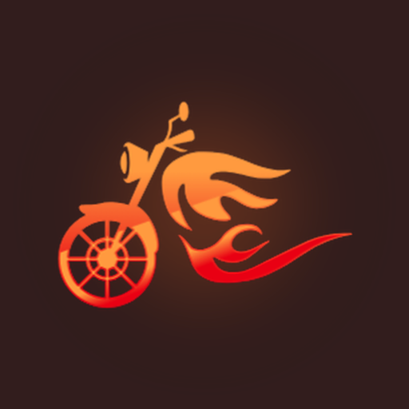

  

<h1 align="center">RideSquad</h1>

  <b>Ride together. Stay together.</b> 
  A group-ride app for bikers: plan the route, share a code, and keep the whole squad on one live map.

  <a href="https://github.com/shreyanshgupta44/ridesquad/releases/latest/download/RideSquad.apk"><b>⬇ Download for Android</b></a>
  ·
  <a href="https://shreyanshgupta44.github.io/ridesquad/">Website</a>
  ·
  <a href="https://shreyanshgupta44.github.io/ridesquad/privacy.html">Privacy policy</a>

---

## Features

| | |
|---|---|
| 🛣️ **Plan the route** | Add a start, stops and a destination. The route is calculated and everyone in the ride sees the same line on the map. |
| 🔑 **Join with a code** | The leader shares a 6-character code. Friends enter it and they are in. |
| 📍 **Live map** | See every rider's position in real time, even while phones are locked in the handlebar mount. |
| 🆘 **One-tap alerts** | SOS, accident, bike issue, fuel, chai break and more, sent to the whole group as notifications. No signal? SOS falls back to an SMS with your location. |
| 👑 **Leader & sweep** | The leader starts and ends the ride; the sweep rides at the back so nobody gets left behind. |
| ✅ **Checkpoints** | Riders check in at each stop, so the group knows who has reached. |
| 📊 **History & stats** | Finished rides, distance ridden and ride summaries. |
| 🌙 **Map styles** | Dark, Light or Street maps. |

## Install (Android)

1. Tap **[Download for Android](https://github.com/shreyanshgupta44/ridesquad/releases/latest/download/RideSquad.apk)**.
2. Open the downloaded **RideSquad.apk**.
3. If Android asks, allow installing apps from your browser (**Settings → Allow from this source**).
4. Tap **Install** and open RideSquad.
5. Open it once, close it fully and open it again to get the latest updates.

Updates arrive automatically inside the app, so you rarely need to download a new APK.

## Privacy

RideSquad only shares your location **while you are in an active ride**, and only with the riders in that ride. No ads, no selling data.

- [Privacy policy](https://shreyanshgupta44.github.io/ridesquad/privacy.html)
- [Delete your account](https://shreyanshgupta44.github.io/ridesquad/delete-account.html): in the app under **Profile → Delete account**, or by email.

## Built with

[Expo](https://expo.dev) & React Native · [Supabase](https://supabase.com) · [MapLibre](https://maplibre.org) with [OpenFreeMap](https://openfreemap.org) · [OpenRouteService](https://openrouteservice.org)

## Contact

Questions, bugs or ideas: **[ridesquad.support@gmail.com](mailto:ridesquad.support@gmail.com)**

---

Made with 🧡 by <b>Shreyansh</b> · a rider, for riders

